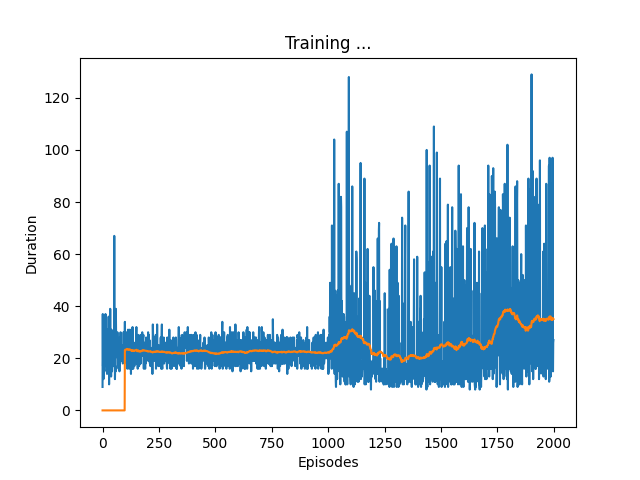
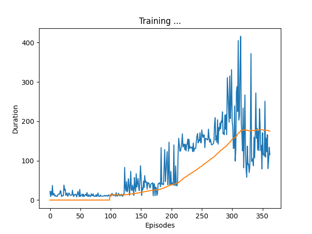
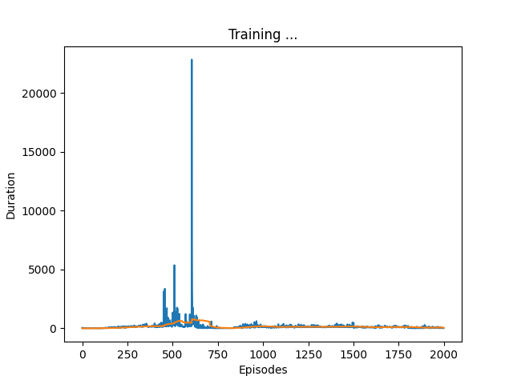

# Rapport DQN Gout Numa

## Introduction

Dans ce TP nous allons implémenter l'algorithme de *Deep Q-Network* grâce à la bibliothèque python d'environnement *Gym*. Puis sur un environnement plus compliqué s'inspirant du jeu *Minecraft* de Mojang.

## Partie I : Familiarisation avec *Gym*

Gym propose une large catégorie d'environnements pour expérimenter des algorithmes de RL. Leur but est de fournir une grande gamme d'environemments variés afin d'améliorer les progrès dans l'apprentissage par renforcement.

*Gym* propose donc beaucoup d'environemments, à chaque étape l'agent effectue une action, l'observation de l'environnement change et une récompense nous est donnée. Nous utiliserons l'environnement CartPole-v1 dans la première partie du TP. *Gym* est fourni avec une méthode de rendu d'image et un *VideoRecorder* qui va nous permettre d'enregistrer les actions de notre agent entrainé.

## Partie II : Algorithme DQN

### II.1 ReplayMemory

L'algorithme fonctionne avec une mémoire circulaire, quand la mémoire est remplie les premières observations sont ecrasées. Il y est stocké le tuple `(state, action, next_state, reward)`.

Notre implémentation se trouve dans le fichier `ReplayMemory.py`. Nous implémentons 3 méthodes dans notre classe. 
- `push` qui ajoute une étape et écrase les précédentes si nécéssaire.
- `sample` qui renvoie un échantillon de la mémoire de la taille `batch_size`
- `len` qui renvoie la longueur de la mémoire actuelle. Servira pour le début de l'apprentissage car au début la mémoire est vide, on ne peut donc pas extraire un échantillon.

### II.2 Apprentissage

Nous allons utliser un réseau de neurones pour approcher la Q-valeur des couples $Q(s,a)$. 

J'utilise un réseau de neurones avec une couche cachée de 256 neurones et une fonction d'activation ReLU. Le code se trouve dans le fichier `DQN_cartpole.py`.

Il y a ensuite le fichier `cartpole_agent.py` qui est le fichier d'entrainement de notre agent. L'apprentissage fonctionne comme suit :
- La fonction `__init__` est appelée et initialise l'environnement *Gym*, les réseaux de la politique et de la cible et les hyperparamètres ($\gamma$, $\epsilon$, la taille de la mémoire, $\epsilon_{decay}$, la taille des batch de sample de la mémoire et la fréquence d'actualisation du réseaux cible)
- La fonction `train` est appelée ensuite et est responsable de l'apprentissage du réseaux. Pour le nombre d'épisode défini en paramètre, l'agent choisi une action avec la méthode $\epsilon$-greedy avec la fonction `select_action`. Il actualise ensuite sa mémoire et modifie les poids avec la méthode `optimize_mode`. Il actualise le réseaux cible avec un pas régulier et fait les plots nécéssaire.

La fonction `optimize_model` rétropropage l'erreur grâce à la fonction de perte :
$$ \mathcal{L}_{DQN} = \left\{
    \begin{array}{ll}
        ||Q(s,a) - (r+\gamma \max_{a'}Q(s',a'))||^2 & \text{si l'épisode continu} \\
        ||Q(s,a) - r||^2 & \text{sinon}
    \end{array}
\right.$$

On sépare donc les états finaux des autres puis on effectue les calculs. 

Ensuite il y a le fichier `test_agent_cartpole.py` qui est utilisé pour tester l'agent. Il permet aussi de prendre une video.

### II.3 Expérimentation et résultat

Premièrement j'ai passé beaucoup de temps sans comprendre pourquoi mon mes épisodes s'arrêtaient à 500 piles et ne montaient pas plus haut, cela était dû au fait que mon environnement n'était pas unwrapped.

J'ai remarqué que mon apprentissage était supérieur lorsque `self.target_update` n'était pas trop élevé. J'ai l'impression que le meilleur se situe pour la valeur de 30.

Voici une graphe d'apprentissage avec une update tous les 1000 épisodes.

Et une avec une update toutes les 30

Étant à l'école Centrale de Lyon, nous avons fait un peu le même travail mais en utilisant la fonction de perte de Huber qui agit comme la MSE quand l'erreur est faible mais comme la MAE quand la différence est élevée et j'ai remarqué quelques différence.

Premièrement l'apprentissage avec la fonction de perte de Huber est un peu plus rapide mais il y a des comportements bizarre. La courbe de la moyenne des récompenses n'est pas vraiment croissante mais oscille, de plus il y a des pics qui apparaissent sans prévenir.

Sur cette figure on voit l'apprentissage qui croit de manère "fluide" (j'ai coupé assez tôt car sinon les montres atteignant 20000 m'empêche de voir les faibles valeurs.)

Ces comportements (qui apparaissent pour la MSE loss fonction mais à moindre mesure) m'ont donné une idée. J'ai ajouté un argument à la classe `Agent` qui stocke le temps de jeu maximal atteint par l'agent et si celui-ci est dépassé, je sauvegarde le modèle.

Ici j'ai sauvegardé les poids du modèle qui arrive à 25000 environs.

Avec cette technique j'obtiens un modèle extrèmement performant. Tellement performant qu'il est en réalité immortel avec un $\epsilon$ de valeur nulle (ie pas d'exploration). Ce qui faisait perdre ces "monstres" était en réalité la faible chance que 10 fois d'affilé le hasard faisait explorer l'agent (10 étant le nombre minimal de coup pour perdre).

Vous pouvez trouver la vidéo tronqué au bout de 500 étapes dans le dossier `videos`.

Les modèles sont stocké dans le dossier `models`. Le modèle "immortal_boy" reste immobile et "immortel_mobile" fait des petits aller-retour.

## Partie III : MineRL

J'ai essayé de faire fonctionner MineRL sur mon ordinateur mais impossible d'importer le dossier `custom_environments`.

J'ai abandonné après quelques jours je suis désolé.